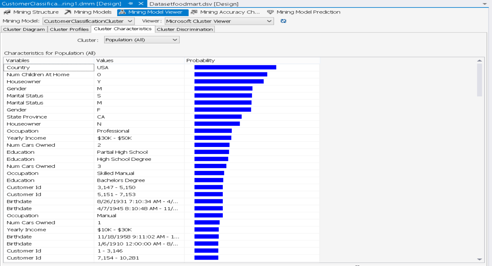
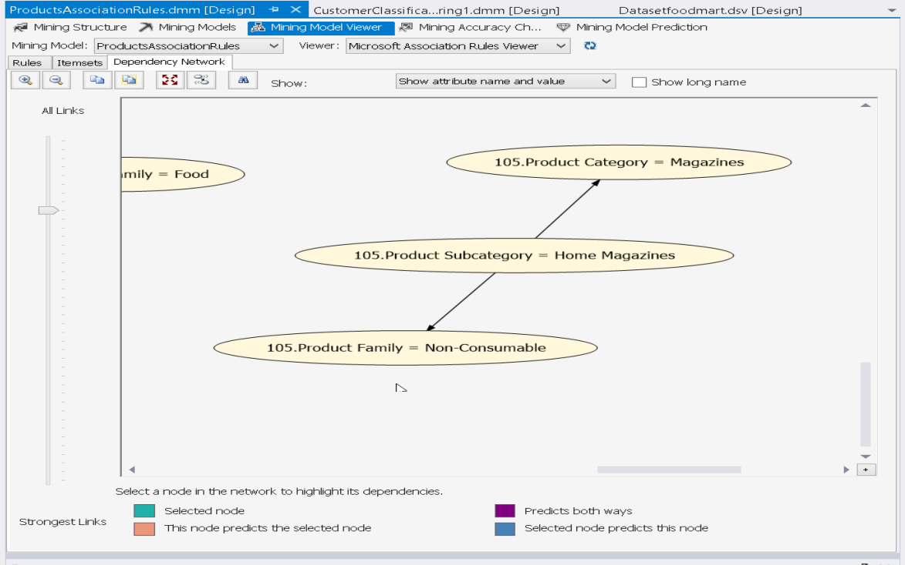
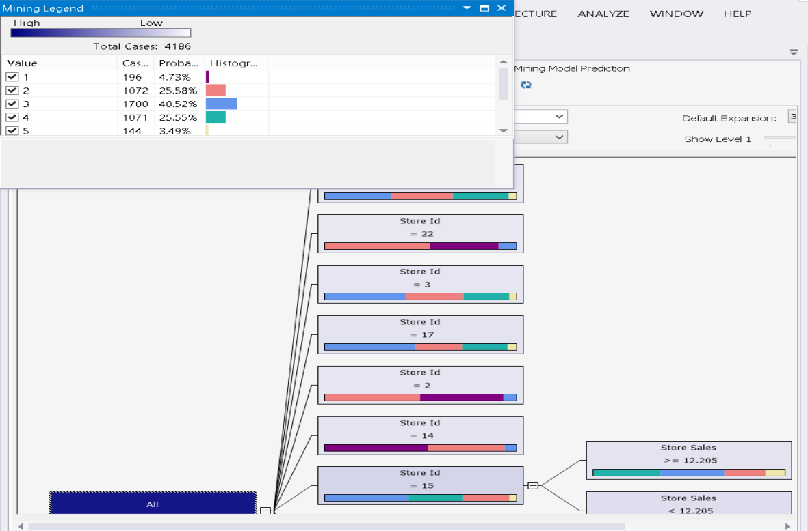
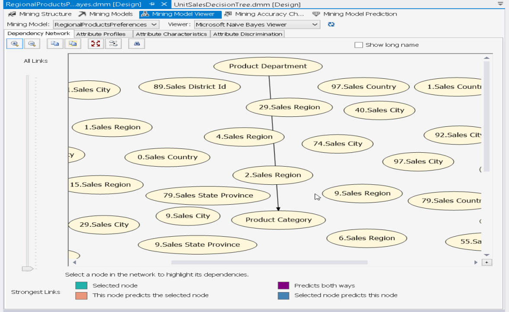
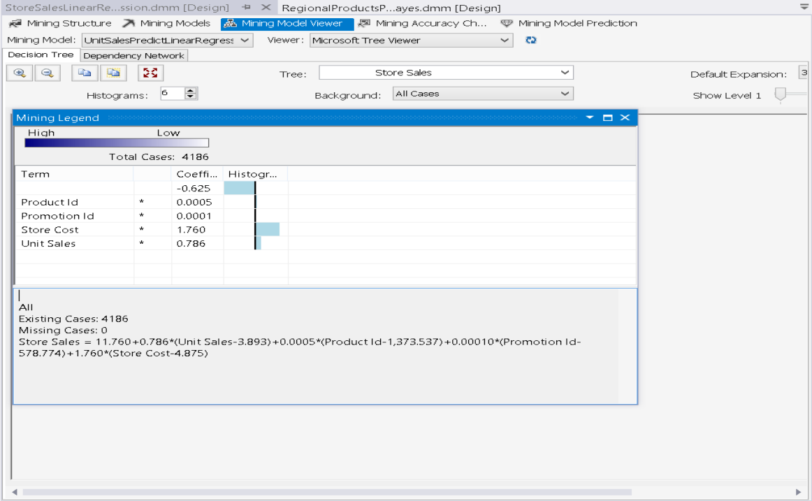

Data Mining Project

This project was developed as part of my Master's coursework in Data Mining, showcasing a collection of algorithms and techniques applied to the foodmart dataset. I have worked on Visual Studio and deployed on Ssas server. 
Overview

In this project, I've explored various data mining structures and algorithms to analyze and extract valuable insights from datasets related to customers, products, and regions. The goal is to demonstrate the application of data mining techniques in uncovering patterns, making predictions, and informing decision-making processes.

Algorithms

The project includes implementations of the following algorithms:

    Clustering: Used for customer segmentation and grouping similar products which might be purchased together and a 2nd clustering for predicting based on the customer table how many children customer might have.
    
   

    Association Rules: Identifying  patterns among products purchased together.
  

    Decision Trees: Predictive modeling for unit sales. 
   

    Naive Bayes: Classification tasks such as sentiment analysis on products depending on region of purchase.
   
   
    Linear Regression: Forecasting store sales.
   
